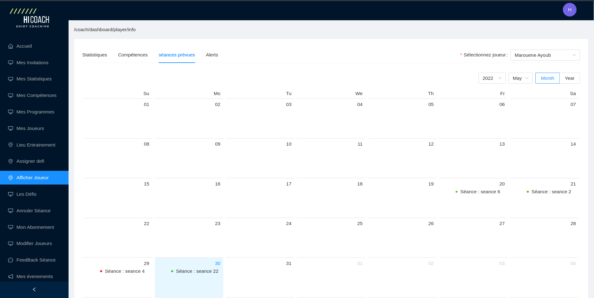

<h1 align="center">
  <br/>
  </a>
  <h4 align="center">A Fitness coaching web application built with <a href="https://reactjs.org/" target="_blank">React</a>.</h4>
  <br/>
</h1>
<div align="center">


[](https://opensource.org/licenses/MIT)
</div>

<p align="center">
  <a href="#basic-overview">Basic overview</a> •
  <a href="#key-features">Key features</a> •
  <a href="#technology-used">Technology used</a> •
  <a href="#how-to-use">How to use</a> •
  <a href="#project-overview">Project overview</a> •
  <a href="#related-to-this-project">Related to this project</a>
  
</p>

## Basic overview
Hicoach is a web application for fitness coaches that was designed to facilitate the exchange of information between coaches and their clients by providing various services and features.

## Key features
* Creating statistics and configure them.
* Create sessions including session plan,objective and setting the training location (receiving a mail of detailed information).
* Displaying detailed session informations inculding session's objectives 
* Displaying detailed informations for each player including charts of statistics,hight,age,ect.
* Setting goals for each player and get notified in case of reaching them.
* Creating challenges for players.
* Change the subsciption plan (for coaches) to get access to more features (number of clients invitation links,ect).

## Technology used

<p align="left">
  
      
    
    
    
</p>

## How to use
To clone and run this application, you'll need [Git](https://git-scm.com) and [Node.js](https://nodejs.org/en/download/) (which comes with [npm](http://npmjs.com)) installed on your computer.
From your command line:
```bash
# Clone this repository
$ git clone https://github.com/salimkazdaghli/Hicotech-Frontend.git

# Go into the repository
$ cd Hicotech-Frontend

# Install dependencies
$ npm install

# Run the app
$ npm start
```


## Project overview


| | |
|:-------------------------:|:-------------------------:|
|||  |  ||
|  |  |

## Related to this project

- [Hicoach Backend](https://github.com/salimkazdaghli/Hicotech-Backend.git) - Hicoach backend API.
